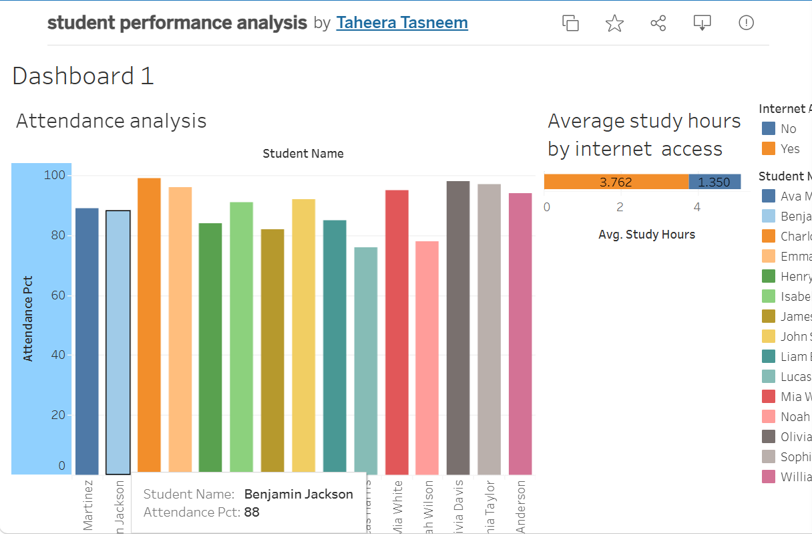

Pandas Practice - mtcars Dataset

This project explores the **mtcars dataset** using Python and pandas.

## 📌 Objectives
- Understand dataset structure
- Convert data types
- Analyze categorical and numerical variables
- Practice pandas functions

## 🛠️ Tools Used
- Python
- Pandas
- Jupyter Notebook

## 📂 Files
- `Pandas.ipynb` → Main notebook with analysis

## 🔍 Key Tasks Performed
- Checked data types using `.dtypes`
- Converted columns to `category`
- Viewed data using `.head()`
- Explored dataset structure

## 📈 Dataset
The dataset contains information about cars such as:
- mpg (miles per gallon)
- cylinders
- horsepower
- weight
- transmission type
# Student Performance Dashboard

## Tools Used
- Tableau Public
- Python
- MySQL
- Pandas

## Project Description
This project analyzes student attendance, study hours, and internet access.

## Features
- Attendance analysis
- Internet access vs study hours
- Interactive dashboard

## Tableau Public Dashboard
PASTE YOUR TABLEAU LINK HERE

## Dashboard Preview

